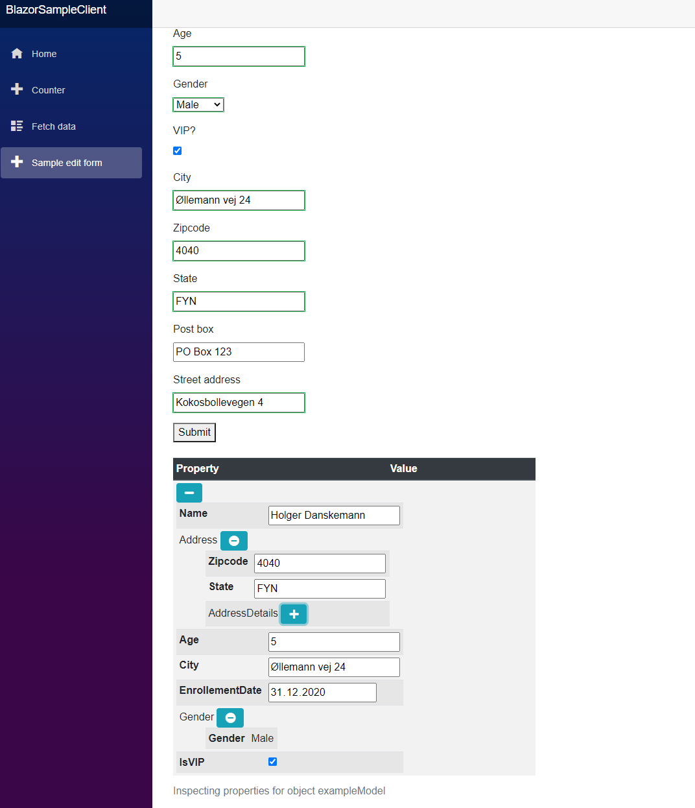

# Blazor property grid

This is a simple property grid component for objects with nested 
structure for Blazor apps. It has been tested with asp.net core 3.1
created via dotnet new blazorserver

it utilizes font awesome, twitter bootstrap, jquery and you can see 
the versions used in libman.json


```json
{
  "version": "1.0",
  "defaultProvider": "cdnjs",
  "libraries": [
    {
      "library": "twitter-bootstrap@4.5.3",
      "destination": "wwwroot/twitter-bootstrap/"
    },
    {
      "library": "jquery@3.5.1",
      "destination": "wwwroot/jquery/"
    },
    {
      "library": "font-awesome@5.15.1",
      "destination": "wwwroot/font-awesome/"
    }
  ]
}

``` 

Note that this component do not support editing yet. 

These data types got their own read only editors:

* DateTime 
* Float
* Decimal
* Int
* Double
* String
* Bool

Nullable types have not been tested much yet. 

In case you have wishes for forking the repo, do so freely. This component is fully open source (GNU public license). 

I welcome also pull requests. 



## Using the component - API 

The following razor markup shows the component in use. 

```xml

<BlazorPropertyGridComponents.Components.PropertyGridComponent
 PropertySetValueCallback="OnPropertyValueSet"
 ObjectTitle="exampleModel"
 DataContext="@exampleModel">
</BlazorPropertyGridComponents.Components.PropertyGridComponent>


@code {
    private void OnPropertyValueSet(PropertyChangedInfoNotificationInfoPayload pi){
        if(pi != null){
            JsRunTime.InvokeVoidAsync("updateEditableField", pi.FieldName, pi.FullPropertyPath, pi.Value); 
        }
    }

    private CustomerModel exampleModel = new CustomerModel
    {
        Address = new AddressInfo
        {
            Zipcode = 7045,
            AddressDetails = new AddressInfoDetails
            {
                Box = "PO Box 123"
            }
        }
    };

    private void HandleValidSubmit()
    {

    }

}


```

The following properties must be set on the component:
* DataContext - set this to the object the property grid component should display and optionally edit.

The following properties should be set on the component:
* ObjectTitle - the name of the object. 

And the following must be set if editing is desired:
* PropertySetValueCallback - delegate method to handle editing. 
The method must accept one parameter of type 
*PropertyChangedInfoNotificationInfoPayload* and preferably be of type void. It is suggested to use 
JsRunTime to reflect changes back to the web user interface - Blazor cannot propagate these changes without 
Javascript being used. (Or if you have a suggestion of avoiding this, please drop hints or a pull request to this component!)

## Pull requests / suggestions ? 
If you have suggestions or pull requests, please contact. This component provides a free basic property grid for use in Blazor community.


## Quick tip - publishing this pacakge to Nuget.org from CLI

First: Edit the BlazorPropertyGridComponents project file and bump the 
version number of the Version element inside. Versions must be unique in Nuget.

E.g. bump to 1.2.0 or similar:

<Version>1.1.0-alpha</Version>


Run dotnet build to build the component package
```bash
dotnet restore
dotnet build
```

Run dotnet pack to create nuget package
```bash
BlazorPropertyGrid\ComponentLibrary>dotnet pack BlazorPropertyGridComponents.csproj --configuration Release                                                                                  
```

Now push the nuget packed file *.pkg file to nuget.org. Adjusting the version number to match up with the version number you set.
BlazorPropertyGrid\ComponentLibrary>dotnet nuget push bin\Release\BlazorPropertyGridComponents.1.0.0.nupkg --api-key TOP_SECRET  --source https://api.nuget.org/v3/index.json

<hr />

Last update: 11th of January 2021

Tore Aurstad
tore.aurstad@gmail.com  