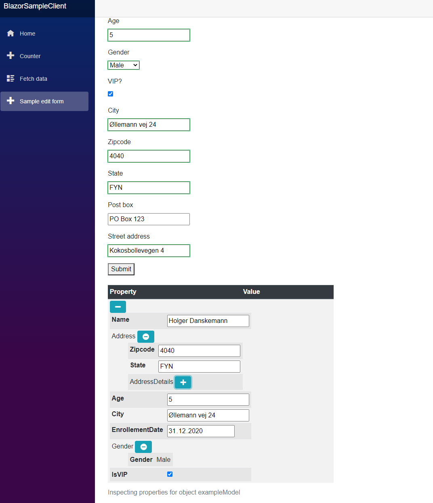

# Blazor property grid

This is a simple property grid component for objects with nested 
structure for Blazor apps. It has been tested with asp.net core 3.1
created via dotnet new blazorserver

it utilizes font awesome, twitter bootstrap, jquery and you can see 
the versions used in libman.json


```json
{
  "version": "1.0",
  "defaultProvider": "cdnjs",
  "libraries": [
    {
      "library": "twitter-bootstrap@4.5.3",
      "destination": "wwwroot/twitter-bootstrap/"
    },
    {
      "library": "jquery@3.5.1",
      "destination": "wwwroot/jquery/"
    },
    {
      "library": "font-awesome@5.15.1",
      "destination": "wwwroot/font-awesome/"
    }
  ]
}

``` 

Note that this component do not support editing yet. 

These data types got their own read only editors:

* DateTime 
* Float
* Decimal
* Int
* Double
* String
* Bool

Nullable types have not been tested much yet. 

In case you have wishes for forking the repo, do so freely. This component is fully open source (GNU public license). 

I welcome also pull requests. 



<hr />

Last update 31s of the December, 2020

Tore Aurstad
tore.aurstad@gmail.com 